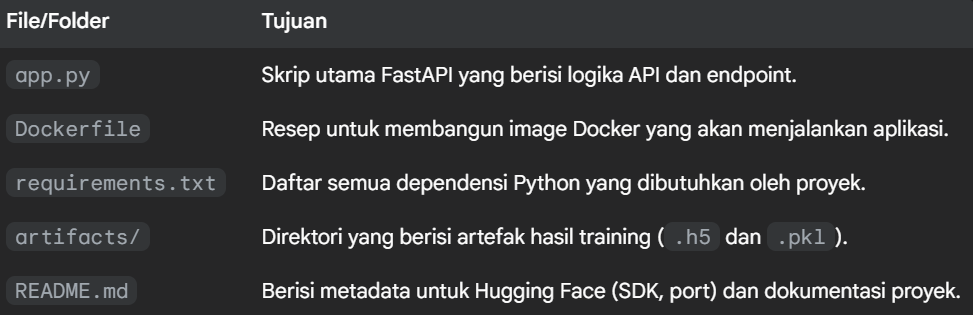
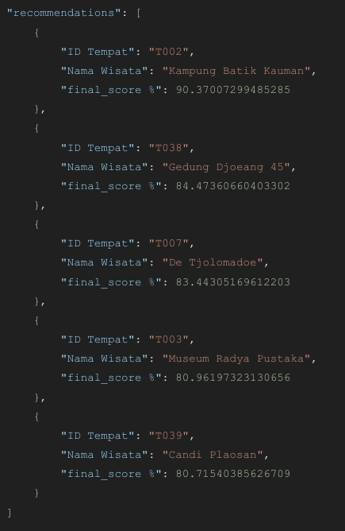

# 🌟 SISTEM REKOMENDASI TEMPAT WISATA 🌟

[](https://www.python.org/)
[](https://www.tensorflow.org/)
[](https://keras.io/)
[](https://pandas.pydata.org/)
[](https://scikit-learn.org/)
[](https://opensource.org/licenses/MIT)

## 👨‍👩‍👧‍👦 TIM PENGEMBANG

| Nama | Peran |
|------|-------|
| Adyatma Kevin | Design Researcher |
| Keimaz Delan | Data Engineer |
| Fairah Almira | Data Engineer |
| Andhika Reihan H | Machine Learning Engineer |
| Handy Arfiano H| Machine Learning Engineer |
| Farraheira | Scrum Master AI dan Machine Learning Ops |

## 📝 DESKRIPSI PROYEK

Proyek ini mengembangkan sistem rekomendasi tempat wisata dengan pendekatan hybrid menggunakan kombinasi model **Collaborative Filtering** (berbasis NCF) dan **Content-Based Filtering**. Sistem ini dirancang untuk memberikan rekomendasi yang personalisasi baik untuk pengguna yang sudah memiliki riwayat interaksi maupun pengguna baru.

## 💡 Latar Belakang Ide

### 🎯 Tema

**Personalisasi Pengalaman Pariwisata dan Rekomendasi Cerdas** 

Era digital telah mengubah cara orang mencari dan memilih destinasi wisata. Dengan semakin banyaknya pilihan tempat wisata yang tersedia, menemukan tempat yang benar-benar sesuai dengan minat dan preferensi individu menjadi tantangan tersendiri. Tema utama proyek ini adalah memanfaatkan data dan teknologi Machine Learning untuk menciptakan pengalaman pencarian dan penemuan tempat wisata yang lebih personal, relevan, dan efisien bagi pengguna.

### ❓ Masalah

**Overload Informasi dan Rekomendasi yang Tidak Relevan** 

Salah satu masalah utama yang dihadapi wisatawan modern adalah **overload informasi**. Ribuan tempat wisata, ulasan, artikel blog, dan iklan bersaing untuk menarik perhatian. Tanpa panduan yang efektif, pengguna bisa merasa kewalahan dan kesulitan menemukan 'permata tersembunyi' atau tempat yang paling cocok untuk mereka. 

Sistem rekomendasi tradisional yang hanya mengandalkan popularitas atau filter sederhana seringkali gagal menangkap nuansa preferensi individual. Ini mengakibatkan rekomendasi yang **tidak akurat atau kurang relevan**, membuang waktu pengguna dan berpotensi membuat mereka melewatkan pengalaman wisata yang ideal. Bagi pengguna baru tanpa riwayat interaksi, masalah 'dingin' (cold-start problem) juga menjadi tantangan besar dalam memberikan rekomendasi awal yang berarti.

### ✅ Solusi

**Sistem Rekomendasi Hybrid Cerdas** 

Untuk mengatasi masalah tersebut, kami mengusulkan dan membangun **Sistem Rekomendasi Hybrid Cerdas** menggunakan pendekatan Machine Learning. Solusi ini menggabungkan kekuatan dua metode rekomendasi utama:

* **🤝 Collaborative Filtering (Berbasis NCF)**: 
  Memanfaatkan pola interaksi (rating/ulasan) dari banyak pengguna untuk mengidentifikasi item yang disukai oleh pengguna dengan preferensi serupa. Ini membantu menangkap preferensi berdasarkan perilaku komunitas. Kami menggunakan Neural Collaborative Filtering (NCF) untuk pemodelan interaksi user-item yang lebih kompleks.

* **🔍 Content-Based Filtering**: 
  Menganalisis fitur-fitur intrinsik dari tempat wisata itu sendiri (seperti kategori, deskripsi, fasilitas, rating eksternal) untuk merekomendasikan item yang serupa dengan apa yang disukai pengguna di masa lalu atau yang sesuai dengan preferensi yang mereka berikan.

Dengan menggabungkan kedua pendekatan ini, model hybrid kami dapat memberikan rekomendasi yang lebih kaya dan akurat. Untuk pengguna yang sudah memiliki riwayat, model dapat memprediksi potensi minat mereka pada item baru. Untuk pengguna baru (cold-start), sistem dapat menggunakan fitur item dan informasi preferensi awal (misal: kategori yang disukai) untuk memberikan rekomendasi awal yang relevan, bahkan tanpa data interaksi sebelumnya.

## 📂 DATASET

### 📊 Pengumpulan Data

Kami mengumpulkan dataset sendiri. Untuk lebih detail, data dapat dilihat pada repositori GitHub berikut:

🔗 [Repository Dataset](https://github.com/KeimDel/my-data-projects/tree/main/recommendation-system-data-engineer)

## 🛠️ ALGORITMA DAN MODEL

### 📚 Framework

Kami menggunakan framework machine learning berikut:

* **🔄 TensorFlow 2.x**: Platform end-to-end open source untuk machine learning.
* **🧠 Keras**: API tingkat tinggi yang berjalan di atas TensorFlow, memudahkan pembangunan dan pelatihan model neural network.
* **🐼 Pandas**: Untuk manipulasi dan analisis data.
* **📊 Scikit-learn**: Untuk preprocessing data dan evaluasi metrik.
* **⚙️ Keras-Tuner**: Untuk optimasi hyperparameter model Keras.

### 🏗️ Pembangunan Model

Sistem rekomendasi ini menggunakan **Model Hybrid Neural Collaborative Filtering (NCF) dengan Feature Item Tambahan**.

#### Spesifikasi dan detail pelatihan model:

* **🧩 Arsitektur Model**: 
  Model Hybrid menggabungkan embeddings dari User dan Item (pendekatan Collaborative Filtering) dengan fitur-fitur deskriptif Item (seperti kategori, rating Google Maps, kategori umur) melalui jalur MLP terpisah, kemudian menggabungkannya untuk memprediksi rating yang dinormalisasi. Model menyertakan lapisan Batch Normalization dan Dropout untuk stabilisasi dan regularisasi, serta L2 Regularization pada embeddings dan Dense layer.

* **📥 Input Model**:
  * `user_input`: ID User yang sudah di-encode (integer).
  * `item_input`: ID Tempat Wisata yang sudah di-encode (integer).
  * `features_input`: Fitur-fitur item yang sudah diproses (rating, kategori, umur), dinormalisasi.

* **📤 Output Model**: 
  Prediksi rating yang dinormalisasi (nilai antara 0 dan 1).

* **📉 Fungsi Loss**: 
  Mean Squared Error (MSE).

* **⚡ Optimizer**: 
  Adam.

* **📏 Metrik**: 
  Mean Absolute Error (MAE).

* **🔧 Hyperparameter Tuning**: 
  Menggunakan KerasTuner (RandomSearch) untuk menemukan kombinasi hyperparameter terbaik (embedding_dim, mlp_units, dropout_rate, learning_rate, l2_reg_factor) berdasarkan `val_mae`.

* **🏋️ Pelatihan**:
  * **Epochs**: Hingga 120 (dengan Early Stopping).
  * **Batch Size**: 128.
  * **Callbacks**: Early Stopping (monitor `val_mae`, patience 15, restore best weights).
  * **Data Split**: 80% Training, 20% Testing.

Model terbaik dari proses tuning kemudian dilatih ulang dengan hyperparameter optimal pada data training dan dievaluasi pada data testing.

### 🎯 Rekomendasi

Sistem ini memiliki tiga skenario rekomendasi:

1. **👤 Untuk Pengguna yang Dikenal dengan Riwayat Review**: 
   Menggunakan model NCF untuk memprediksi rating pada item yang belum dinilai, kemudian meningkatkan (boost) peringkat item kandidat teratas dengan skor kemiripan konten (Cosine Similarity) berdasarkan item-item yang disukai pengguna.

2. **🆕 Untuk Pengguna Baru dengan Preferensi Kategori**: 
   Menggunakan model NCF untuk menghitung 'daya tarik' rata-rata item dari perspektif sekelompok 'probe user' yang mewakili pola umum pengguna yang aktif, dikombinasikan dengan skor rating Google Maps. Hasil ini digabungkan dengan filter kategori yang dipilih pengguna.

### 📊 Evaluasi Model

Model terbaik dari proses tuning dievaluasi pada data testing untuk mengukur kinerjanya dalam memprediksi rating. Metrik utama yang digunakan adalah **Mean Absolute Error (MAE)** dan **Mean Squared Error (MSE)**.

MAE menunjukkan rata-rata selisih absolut antara rating yang diprediksi dan rating aktual, memberikan gambaran seberapa 'jauh' prediksi kita dari nilai sebenarnya dalam skala rating yang dinormalisasi (0-1). MSE memberikan bobot yang lebih besar pada kesalahan yang lebih besar.

## 🔌 INTEGRASI

API ini dirancang untuk kemudahan integrasi dengan berbagai platform, seperti aplikasi web. Interaksi dilakukan melalui protokol HTTP standar dengan format data JSON, memastikan kompatibilitas yang luas.

### 🏛️ Arsitektur Integrasi

Integrasi dilakukan dengan mengirimkan request POST ke endpoint utama API. Berdasarkan input yang diberikan (ID pengguna atau preferensi kategori), API akan mengembalikan daftar rekomendasi wisata yang terpersonalisasi.

**Endpoint Utama**: 
```
https://farrah29-tourism-recommendation-api.hf.space/recommendations
```

**Metode**: POST

**Content-Type**: application/json

### 💻 Contoh Integrasi Dengan Javascript

Berikut adalah contoh kode JavaScript menggunakan fetch API untuk berinteraksi dengan layanan rekomendasi dari sebuah aplikasi web:

```javascript
// Alamat endpoint API yang telah di-deploy
const API_ENDPOINT = 'https://farrah29-tourism-recommendation-api.hf.space/recommendations';

/**
 * Fungsi untuk mengambil rekomendasi dari API.
 * @param {object} requestBody - Body request yang akan dikirim.
 * @returns {Promise<Array>} - Sebuah promise yang akan resolve dengan array rekomendasi.
 */
async function getRecommendations(requestBody) {
    try {
        console.log('Mengirim request ke API:', JSON.stringify(requestBody));

        const response = await fetch(API_ENDPOINT, {
            method: 'POST',
            headers: {
                'Content-Type': 'application/json',
            },
            body: JSON.stringify(requestBody),
        });

        // Cek jika response tidak sukses (misal: error 4xx atau 5xx)
        if (!response.ok) {
            throw new Error(`HTTP error! Status: ${response.status}`);
        }

        const data = await response.json();
        
        // Cek jika array rekomendasi kosong
        if (data.recommendations && data.recommendations.length > 0) {
            console.log('Rekomendasi diterima:', data.recommendations);
            return data.recommendations;
        } else {
            console.log('Tidak ada rekomendasi yang cocok ditemukan.');
            return [];
        }

    } catch (error) {
        console.error('Gagal mengambil data dari API:', error);
        // Kembalikan array kosong jika terjadi error
        return [];
    }
}

/**
 * Fungsi untuk menampilkan hasil rekomendasi ke halaman web.
 * @param {Array} recommendations - Array objek rekomendasi.
 */
function displayRecommendations(recommendations) {
    const container = document.getElementById('recommendation-container');
    container.innerHTML = ''; // Kosongkan kontainer sebelum menampilkan hasil baru

    if (recommendations.length === 0) {
        container.innerHTML = '<p>Maaf, kami tidak menemukan rekomendasi yang sesuai untuk Anda saat ini.</p>';
        return;
    }

    recommendations.forEach(item => {
        const card = document.createElement('div');
        card.className = 'recommendation-card';
        card.innerHTML = `
            <h3>${item['Nama Wisata']}</h3>
            <p>ID: ${item['ID Tempat']}</p>
            ${item['Overall Rating (Google Maps)'] ? `<p>Rating: ${item['Overall Rating (Google Maps)']} ⭐</p>` : ''}
        `;
        container.appendChild(card);
    });
}

// --- Contoh Penggunaan ---

// 1. Untuk pengguna baru dengan preferensi kategori
const newUserRequestBody = {
    preferred_categories: ["budaya", "sejarah"],
    n: 5
};

// getRecommendations(newUserRequestBody).then(displayRecommendations);

// 2. Untuk pengguna yang sudah dikenal (ganti dengan ID valid)
const existingUserRequestBody = {
    user_id: "U000001", 
    n: 5
};

getRecommendations(existingUserRequestBody).then(displayRecommendations);
```

## 🚀 DEPLOYMENT

Proses deployment dilakukan untuk mengemas model dan logika aplikasi ke dalam sebuah layanan yang dapat diakses secara publik, stabil, dan terisolasi. Model dibangun menggunakan Framework Flask agar website dapat mengakses file model.h5. Platform yang dipilih adalah Hugging Face Spaces dengan menggunakan Docker sebagai SDK.

🔗 **Model H5 yang digunakan**: [Model H5](https://huggingface.co/spaces/farrah29/tourism-recommendation-api/blob/main/artifacts/best_hybrid_ncf_model.h5)

🔗 **API Endpoint**: `https://farrah29-tourism-recommendation-api.hf.space/recommendations`

🔗 **Dokumentasi di Hugging Face**: [Hugging Face](https://huggingface.co/spaces/farrah29/tourism-recommendation-api/tree/main)

### 🔄 Alur Kerja Deployment

Deployment dilakukan melalui serangkaian langkah yang terstruktur untuk memastikan reproduktifitas dan keandalan:

#### 1. 🧪 Pelatihan Model & Serialisasi Artefak:

* Model NCF dilatih menggunakan data historis.
* Hyperparameter terbaik dicari menggunakan KerasTuner.
* Model terbaik disimpan dalam format .h5 (best_hybrid_ncf_model.h5).
* Objek pendukung seperti user_encoder, item_encoder, dan dataframes yang relevan disimpan menggunakan pickle ke dalam file model_data.pkl.

#### 2. 🌐 Pengembangan API dengan Flask:

* **Pembuatan Server Web**: Sebuah server web yang ringan dan andal dibangun menggunakan framework Flask.
* **Pembuatan Endpoint**: Membuat endpoint POST /recommendations yang menjadi gerbang utama untuk menerima data masukan (seperti ID pengguna) dan mengembalikan daftar rekomendasi wisata dalam format JSON.
* **Optimalisasi Performa**: Untuk efisiensi tinggi, semua artefak (model .h5 dan data .pkl) dimuat hanya sekali saat aplikasi pertama kali dijalankan.

#### 3. 📦 Containerisasi dengan Docker:

* Sebuah Dockerfile dibuat untuk mendefinisikan environment aplikasi.
* Menggunakan base image python:3.9-slim untuk menjaga ukuran tetap kecil.
* requirements.txt digunakan untuk menginstal semua dependensi yang diperlukan (tensorflow-cpu, fastapi, uvicorn, dll).
* Aplikasi dijalankan menggunakan server Uvicorn di dalam kontainer pada port 7860.

#### 4. ☁️ Deployment ke Hugging Face Spaces:

* Sebuah Space baru dibuat dengan SDK "Docker".
* Kode aplikasi, Dockerfile, dan folder artifacts diunggah ke repositori Git Space tersebut.
* Git LFS (Large File Storage) digunakan untuk menangani file model .h5 yang berukuran besar.
* Hugging Face secara otomatis membangun image Docker dan menjalankan kontainer berdasarkan konfigurasi yang diberikan.

### 🏭 Detail Infrastruktur



## 📊 HASIL

### 📱 Pengujian Fungsionalitas API:



## ✨ KESIMPULAN

Proyek ini telah berhasil mencapai tujuannya untuk membangun dan men-deploy sebuah sistem rekomendasi wisata yang fungsional dan dapat diakses melalui API.

### 🏆 Pencapaian Utama

1. **🔄 Model Hybrid Efektif**: 
   Berhasil mengimplementasikan model Hybrid Neural Collaborative Filtering yang menggabungkan kekuatan collaborative filtering (interaksi user-item) dengan content-based filtering (fitur tempat wisata), yang terbukti memberikan hasil prediksi yang baik (Test MAE: 0.1842).

2. **🚀 Deployment Sukses**: 
   Aplikasi berhasil dikemas menggunakan Docker dan di-deploy secara publik di Hugging Face Spaces, menciptakan sebuah layanan RESTful yang andal dan terisolasi.

3. **🌐 API Fungsional**: 
   API yang dikembangkan mampu melayani dua kasus penggunaan krusial: rekomendasi personal untuk pengguna lama dan rekomendasi berbasis kategori untuk pengguna baru, sehingga mengatasi masalah cold start.
